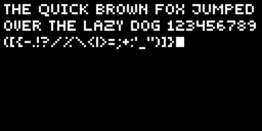

# OledSharp

[](https://www.nuget.org/packages/OledSharp/)


A .NET 8.0 library for drawing text and graphics on small displays. This library provides a simple abstraction for pixel-based displays with built-in text rendering capabilities using fonts defined through the IFont interface. A default font called "Font5x5" is also included.



> The picture above shows an example of what the included font looks like on a 128x64 px display (the image is scaled up 4x for better visibility).

## Overview

This base library provides two interfaces:
- `IOledDisplay` for controlling individual pixels on a display.
- `IFont` for getting character data from a provided character.

This library also provides some classes:
- `TextRenderer` uses an `IOledDisplay` and an `IFont` to draw text to a display.
- `CharacterData` represents the data for a single character in a font.
- `Font5x5` a 5 px implementation of `IFont`.

## Installation

To install the OledSharp base library via NuGet, run the following command in your project directory:

```bash
dotnet add package OledSharp
```

## See also
For implementations of the interfaces in this base library there are two other libraries:

 - [OledSharp.SSD1306](../OledSharp.SSD1306//README.md) (SSD1306 hardware specific display implementation)
 - [OledSharp.Png](../OledSharp.Png/README.md) (File system png output display implementation for debugging and similar)

## Detailed information

### `IOledDisplay` Interface

The main display abstraction interface that all display implementations must implement. Implements `IDisposable` which means it should be disposed of correctly.

**Properties:**
- `int Width { get; }` - Display width in pixels
- `int Height { get; }` - Display height in pixels

**Methods:**
- `void Initialize()` - Initialize the display hardware
- `void SetBufferPixel(int x, int y, bool isOn)` - Set a pixel in the display buffer
- `bool GetBufferPixel(int x, int y)` - Get a pixel value from the display buffer
- `void ClearBuffer()` - Clear the entire display buffer
- `void PushBuffer()` - Push the buffer contents to the actual display
- `void Dispose()` - Clean up resources (inherited from IDisposable)

### `TextRenderer` Class

Handles text rendering on displays. Uses an instance of `IOledDisplay` to draw pixels for a font. Uses an instance of `IFont` to get the `CharacterData` for each character to draw in a text.

> [INFO]
> By default, if no `IFont` is provided, the `TextRenderer` uses the `Font5x5`.

**Properties:**
- `int CharacterSpacing { get; set; }` - Spacing between characters in pixels (default: 1)
- `int LineSpacing { get; set; }` - Spacing between lines in pixels (default: 2)

**Constructors:**
- `TextRenderer(IOledDisplay display)` - Create with default Font5x5
- `TextRenderer(IOledDisplay display, IFont font)` - Create with custom font

**Methods:**
- `void DrawText(string text, int x, int y)` - Draw text at specified position with line break support
- `int DrawCharacter(int x, int y, char character, bool isOn = true)` - Draw single character, returns actual width
- `int DrawString(int x, int y, string text, bool isOn = true)` - Draw string on single line, returns total width
- `int DrawMultiLineString(int x, int y, string text, bool isOn = true)` - Draw multi-line text, returns total height
- `int DrawWrappedString(int x, int y, string text, int maxWidth, bool isOn = true)` - Draw text with word wrapping, returns total height
- `int CalculateStringWidth(string text)` - Calculate pixel width of text
- `int CalculateMultiLineStringHeight(string text)` - Calculate pixel height of multi-line text

### CharacterData Struct

Represents a character with its bitmap data and dimensions.

**Properties:**
- `byte[] Bitmap { get; }` - Bitmap data (width × height bytes, 0 = off, 1 = on)
- `int Width { get; }` - Character width in pixels
- `int Height { get; }` - Character height in pixels
- `int VerticalOffset { get; }` - Vertical offset from baseline (positive = down, negative = up)

**Constructor:**
- `CharacterData(byte[] bitmap, int width, int height, int verticalOffset = 0)`

**Methods:**
- `bool GetPixel(int x, int y)` - Get pixel value at specified coordinates

## Font System

### IFont Interface

Interface for bitmap fonts used by text renderers.

**Properties:**
- `int LineHeight { get; }` - Recommended line height in pixels
- `int BaselineOffset { get; }` - Baseline offset from bottom of line height
- `CharacterData DefaultUnsupportedCharacter { get; }` - Default character for unsupported characters

**Methods:**
- `CharacterData GetCharacter(char character)` - Get character data for specific character
- `bool IsCharacterSupported(char character)` - Check if character is supported

### Font5x5 Class

Default `IFont` implementation that supports the characters:
```
0123456789
ABCDEFGHIJKLMNOPQRSTUVWXYZ
abcdefghijklmnopqrstuvwxyz
åäöÅÄÖ
 .,:;!'?-"%_/\()*[]{}+=<>|
```

> [INFO]
> All characters are drawn as upper case letters.

## Usage Example

```csharp
// Assuming you have an IOledDisplay implementation
using (IOledDisplay display = new YourDisplayImplementation())
{
    display.Initialize();

    // Create text renderer
    TextRenderer renderer = new TextRenderer(display);

    // Draw with word wrapping
    renderer.DrawWrappedString(
        x: 2, // 2 px in from the left edge
        y: 2, // 2 px in from the left edge
        text: "This is a long text that will wrap",
        maxWidth: display.Width - 4); // 2 px from the right edge too

    // Push to display
    display.PushBuffer();
}
```

## License

MIT License - see project file for details.

## Repository

https://github.com/AdamTovatt/oled-sharp