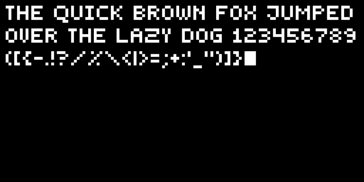

# OledSharp

[](https://www.nuget.org/packages/OledSharp/)


A .NET 8.0 library for drawing text and graphics on small displays. This library provides a simple abstraction for pixel-based displays with built-in text rendering capabilities using fonts defined through the IFont interface.



> The picture above shows an example of what the included font looks like on a 128x64 px display (the image is scaled up 4x for better visibility).

## Overview

This repository contains OledSharp which is a collection of libraries for drawing on small displays. The main library provides the core interfaces and text rendering capabilities, while additional libraries provide specific hardware implementations.

## Libraries

> [IMPORTANT]
> Please refer to the specific library `README.md` files for documentation, this is just the overview file for the repository in general.

### Core Library
- **[OledSharp](OledSharp/README.md)** - Base library with interfaces, text rendering, and default font

### Hardware Implementations
- **[OledSharp.SSD1306](OledSharp.SSD1306/README.md)** - SSD1306 OLED display implementation via I2C
- **[OledSharp.Png](OledSharp.Png/README.md)** - PNG output implementation for testing and debugging

## Quick Start - Writing on an SSD1306 display

1. Install the libraries:
   ```bash
   dotnet add package OledSharp
   ```

   ```bash
   dotnet add package OledSharp.SSD1306
   ```

2. Figure out your I2C bus id

3. Write to the screen:
   ```csharp
   using OledSharp.SSD1306;

   // Create SSD1306 display instance (I2C bus 1, device address 0x3C)
   using (IOledDisplay display = new SSD1306Display(busId: 1, deviceAddress: 0x3C))
   {
       display.Initialize();

       // Create text renderer
       TextRenderer renderer = new TextRenderer(display);

       // Draw with word wrapping
       renderer.DrawWrappedString(
           x: 2, // 2 px in from the left edge
           y: 2, // 2 px in from the left edge
           text: "This is a long text that will wrap",
           maxWidth: display.Width - 4); // 2 px from the right edge too

       // Push changes to display
       display.PushBuffer();
   }
```

4. See the specific library documentation for detailed usage examples.

## License

MIT License - see project files for details.

## Repository

https://github.com/AdamTovatt/oled-sharp
